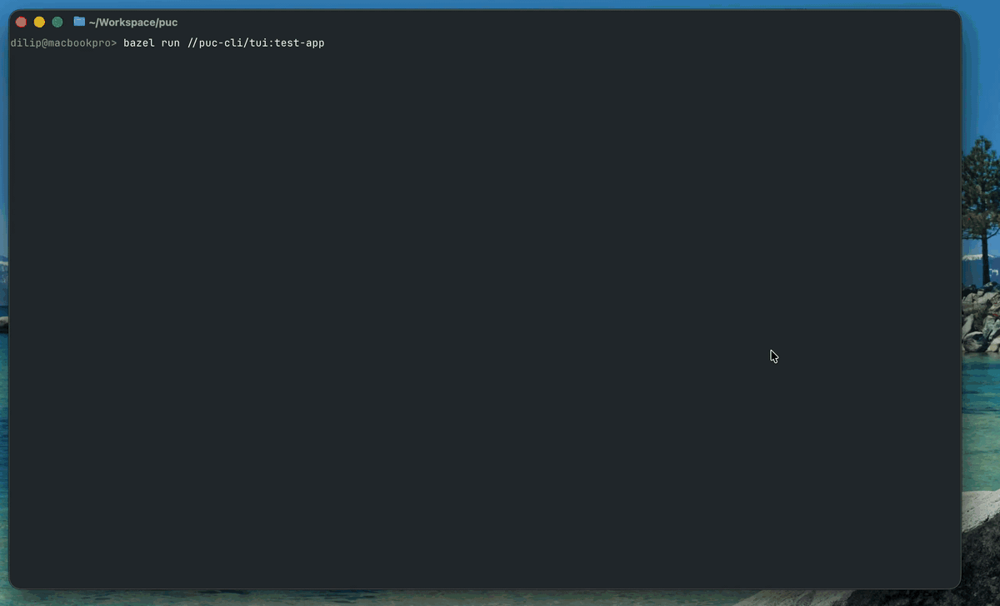

<!-- Generated by utils/scripts/update_docs.sh. Do not edit directly. -->

# File `tui_test_runtime.cpp`

Lifecycle-owned logic for the interactive TUI rendering smoke test.

This runtime backs a manual smoke test rather than an automated unit test. It exercises the integration between Screen, Canvas, Layout, ZBuffer, Frame, Theme, TerminalSession, bounded IPC channels, terminal resize events, Unicode rendering, true color, and parallel Canvas publication. AppState owns the worker, channel, terminal, Screen, renderer, and executable-runtime subsystems and orders their lifecycle from declared dependencies. Every ready frame in the layout is rendered as an independent job, and the last real frame to complete publishes the Canvas A/B transaction. Run it from a real terminal with: `bazel run //puc-cli/test_apps:test-app`

The animation below demonstrates the normal layout, live terminal resizing, and the small-screen fallback:

**Expected display**

On a terminal large enough for the normal layout, the application should display all of the following using the property-backed default-dark theme:

- One error-colored marker touching each of the four screen corners. Each marker is two character cells wide and one cell tall, which appears approximately square with typical terminal-font proportions.
- One theme-text-colored `+` in the center cell of the screen.
- A single-line Unicode box touching the top and right screen edges. The box has a visual width-to-height ratio of 4:3, accounting for the measured pixel dimensions of a terminal cell; it is not expected to contain four columns for every three rows. The top-right marker is drawn over the box corner to verify Z-ordering.
- Three lines inside the box reporting the current terminal width in characters, height in characters, and sampled frame rate. The frame rate normally settles near the loop's 60 FPS cap, but its exact value depends on the terminal and host load.

If either terminal dimension is below the minimum required by the layout, the normal display should be cleared and replaced by a centered `Screen too small` message. The message may be clipped when the terminal is narrower than the message itself.

**Visual verification**

1. Start with a comfortably large terminal and confirm that all four corner markers touch their respective pairs of edges, the `+` is centered, and the metrics box is wider than it is tall.
2. Compare the width and height shown in the box with the terminal's reported row and column counts.
3. Resize the terminal in both directions. The corner markers must remain anchored, the `+` must move to the new center, the metrics values must update, and the box must retain a visually 4:3 shape without leaving stale borders or text behind.
4. Shrink the terminal until `Screen too small` appears. No corner markers, center glyph, metrics box, or old frame contents should remain. Enlarge the terminal and confirm that the normal layout returns.
5. Press Ctrl-C and verify that the alternate screen is left, the cursor and terminal input mode are restored, and the shell remains usable.

**Note:** A terminal window can contain a thin strip of pixels that is smaller than one character cell, especially along its bottom edge. A cell-based TUI cannot draw into that strip; anchors should be judged against the terminal's addressable character grid.

[Source](../../puc-cli/test_apps/tui/tui_test_runtime.cpp)

## Related symbols

- [puc::app::TuiTestRuntimeSubsystem::Impl](classpuc_1_1app_1_1_tui_test_runtime_subsystem_1_1_impl.md)
- [puc](namespacepuc.md)
- [puc::app](namespacepuc_1_1app.md)
